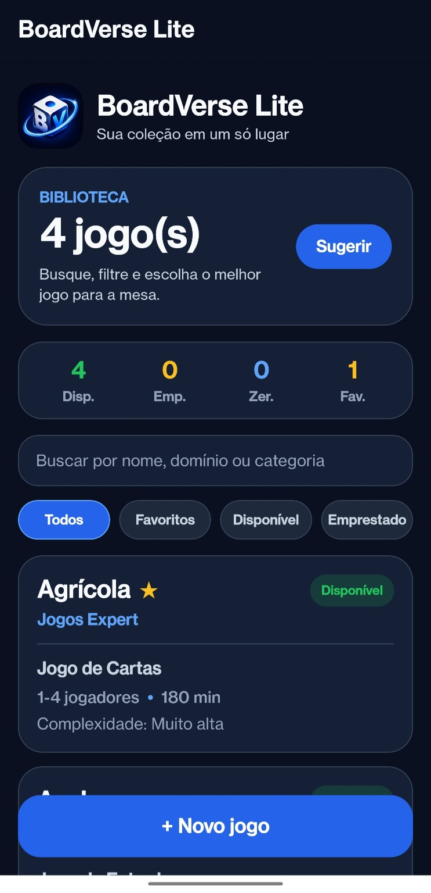
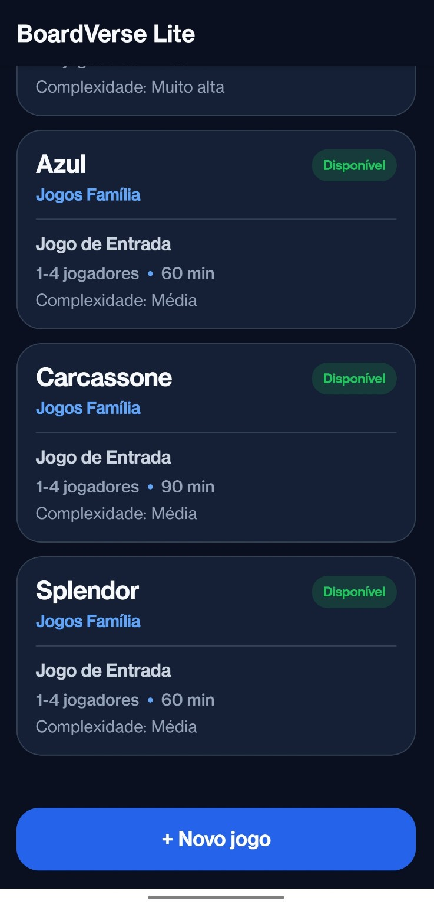
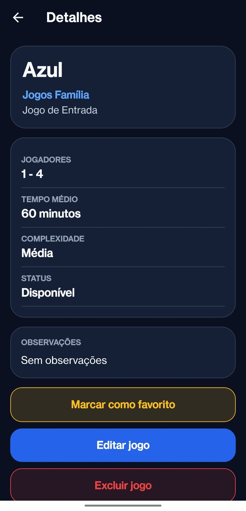
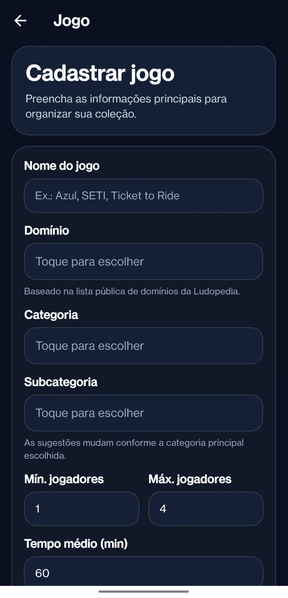

# BoardVerse Lite

Aplicativo mobile desenvolvido em React Native com TypeScript para cadastro, organização e consulta de jogos de tabuleiro. O projeto utiliza persistência local com SQLite e foi desenvolvido como parte da disciplina de Programação para Dispositivos Móveis.

## Objetivo

O BoardVerse Lite tem como objetivo auxiliar o usuário a organizar uma coleção de jogos de tabuleiro, permitindo cadastrar jogos, consultar informações principais, editar registros, marcar favoritos, filtrar a coleção e receber uma sugestão rápida de jogo disponível.

## Tecnologias utilizadas

- React Native
- Expo
- Expo SDK 54
- TypeScript
- SQLite
- Expo SQLite
- React Navigation
- EAS Build

## Funcionalidades

- Cadastro de jogos
- Listagem dos jogos cadastrados
- Edição de registros salvos
- Exclusão com confirmação
- Busca por nome, domínio ou categoria
- Filtro por status
- Filtro de favoritos
- Marcação de jogos favoritos
- Resumo da coleção
- Sugestão rápida de jogo disponível
- Seleção de domínio, categoria, complexidade e status por toque
- Persistência local dos dados com SQLite
- Interface mobile com identidade visual própria

## Entidade principal

A entidade principal do projeto é o jogo de tabuleiro. Cada jogo possui informações como:

- nome
- domínio
- categoria
- quantidade mínima e máxima de jogadores
- tempo médio de partida
- complexidade
- status
- favorito
- observações

## Telas do aplicativo

| Tela inicial | Lista de jogos |
|---|---|
|  |  |

| Detalhes do jogo | Cadastro de jogo |
|---|---|
|  |  |

| Sugestão rápida |
|---|
|  |

## Como executar o projeto

1. Clonar o repositório:

```bash
git clone https://github.com/ThiagoNDuraes/BoardVerseLite.git